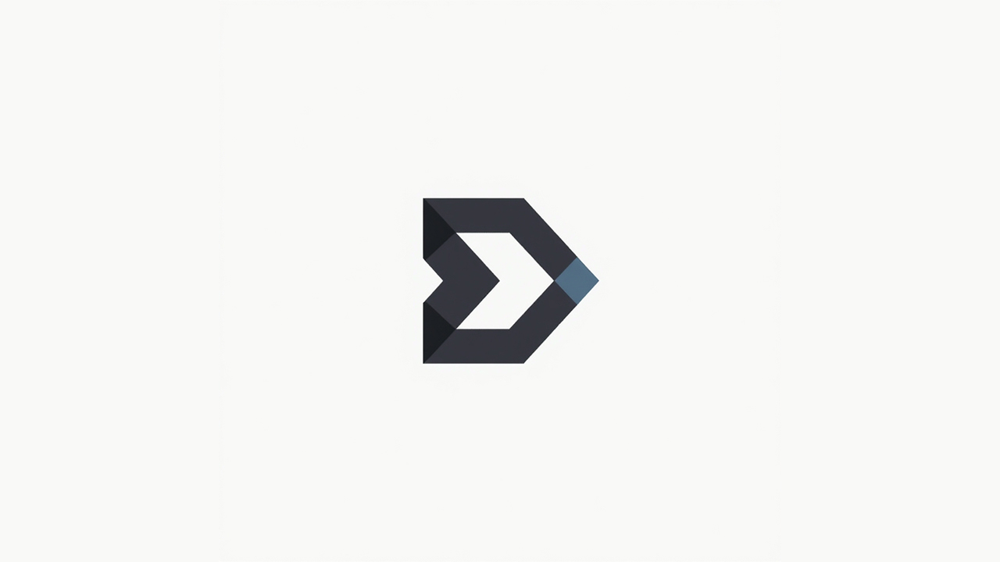

# React Ledgex 🚀

**"Smart, memory-efficient state management for React apps with built-in undo/redo."**

[](https://www.npmjs.com/package/react-ledgex)
[](https://opensource.org/licenses/MIT)



---

## 📚 Quick Links
- [✨ Features](#-features)
- [🚀 Installation](#-installation)
- [💡 Basic Usage](#-basic-usage)
- [🎨 Real-World Example](#-real-world-example-photo-editor-layer-backups-with-undoredo)
- [🎨 Advanced Features](#-advanced-features)
- [🏆 Why Ledgex?](#-why-ledgex)
- [📊 Benchmarks](#-benchmarks)
- [💖 Support](#-support)

## ✨ Features

✅ **Simple Key-Value Store** – Works like `useState` but globally shared and fully type-safe.  
✅ **Time Travel** – Built-in **undo/redo** with minimal overhead.  
✅ **Layer Support** – Isolate and manage state changes like Photoshop layers.  
✅ **Smart & Efficient Storage** –  
   - Only stores **the attributes that actually changed**, not entire objects.  
   - No duplicated entries: repeated actions that don’t change state are **ignored**.  
   - This means even with **large objects (e.g., 30+ attributes)**, memory usage stays **minimal** because unchanged properties reference existing state.  
✅ **No Empty Tickets** – You only "pay" for meaningful changes. Setting a color to red twice won’t create two history entries.  
✅ **Tiny Bundle** – Less than **5KB gzipped**.  
✅ **React Optimized** – Works seamlessly with hooks and integrates easily into existing apps.  


---

## 🚀 Installation

```bash
npm install react-ledgex
# or
yarn add react-ledgex
```

---

## 💡 Basic Usage

### 1. Wrap your app
```jsx
import { LedgexProvider } from 'react-ledgex';

function App() {
  return (
    <LedgexProvider>
      <PhotoEditor />
    </LedgexProvider>
  );
}
```

### 2. Use anywhere
```jsx
import { useLedgex } from 'react-ledgex';

function Editor() {
  const { set, get, undo, redo, getTimeInfo } = useLedgex();
  const { canUndo, canRedo } = getTimeInfo();

  const layer = get('background');

  const handleEdit = () => {
    set('background', { color: '#202020' });
  };

  return (
    <div style={{ background: layer?.color }}>
      <button onClick={undo}>Undo</button>
    </div>
  );
}
```

## 🎨 Real-World Example: Photo Editor Layer Backups (with Undo/Redo)

This example demonstrates how you can use **Ledgex** to **back up complex UI states efficiently**—perfect for use cases like photo editors, where layers are updated frequently and users expect smooth undo/redo functionality.

### 🧠 Concept
- Use **React state** (`useLayers`) for live rendering and immediate feedback to the user.
- Use **Ledgex state** (`useLedgex`) to **store history snapshots** for undo/redo actions.
- Apply **throttling** to prevent storing too many intermediate states (e.g., when the user is dragging or rapidly changing properties).

---

### 🛠 Example Code
```jsx
import { useMemo } from 'react';
import throttle from 'lodash/throttle';
import { useLayers } from './useLayers'; // your live state hook
import { useLedgex } from 'react-ledgex';

const { layers, setLayers } = useLayers(); // For live rendering
const { set, get, undo, redo } = useLedgex(); // For history management (undo/redo)

// Throttle backups to one every 300ms
const throttledSet = useMemo(() => throttle(set, 300), [set]);

// Update layer properties and back up state
const handlePropsChange = (layerId, newProps) => {
    setLayers(prevLayers =>
        prevLayers.map(layer => {
            if (layer.id === layerId) {
                const updatedLayer = layer.clone();
                updatedLayer.updateProps(newProps);

                // Backup the updated layer to Ledgex
                throttledSet({
                    [layerId]: AbstractLayer.toObj(updatedLayer) // Store as Object
                });

                return updatedLayer;
            }
            return layer;
        })
    );
};
```

---

### ✅ **Why This Works So Well**
- **Efficient Memory Usage**:  
  Only essential snapshots are stored, avoiding memory bloat during rapid updates.

- **Smooth User Experience**:  
  Users get instant live previews while undo/redo history is safely maintained in Ledgex.

- **Throttle-Friendly**:  
  Frequent updates (e.g., dragging, key presses) won’t overwhelm your history—only meaningful snapshots are stored.

---

### 🔥 **Production Usage**
This exact pattern is **used in production** to power a photo editor where layer properties (position, size, filters, etc.) change rapidly.  
**Result**: Fast UI updates + stable, memory-friendly undo/redo.

---

💡 **Tip**: Combine with `redo()` and `undo()` from Ledgex to implement time-travel-like editing effortlessly.


---

## 🎨 Advanced Features

### 🔗 Batch Updates (Atomic State Changes)
Ledgex allows you to **batch multiple updates** into a **single undo/redo point**.  
This is ideal for actions where multiple properties or objects should be treated as **one meaningful change**.

- **Example:** Updating both color and position of a layer counts as **one** undo step.  
- **Example:** Aligning three layers at once → a single undo reverts all of them.

```js
useLedgex.set({
  'layer1': { x: 100, y: 200 },
  'layer2': { x: 100, y: 200 },
  'layer3': { x: 100, y: 200 }
}); // Single undo/redo point
```

✅ **Why it matters**:  
- Groups related actions → cleaner user experience.  
- Prevents clutter in history with unnecessary intermediate states.

---

### 🏗 Deeply Nested Object Support
Ledgex handles **nested objects** efficiently, updating only the **deepest meaningful changes**.  
You can safely update complex objects without worrying about memory blow-up or redundant history entries.

```js
useLedgex.set({
  'layer1': {
    filters: {
      brightness: 1.2,
      contrast: 0.8
    }
  }
});
```

✅ **Why it matters**:  
- Works seamlessly with structured data like layers, filters, and settings.  
- Stores only **what actually changed**, even deep inside the object hierarchy.

---

These advanced features make **Ledgex** powerful for apps like **photo editors, diagram tools, or any software with complex state**—without sacrificing performance or simplicity.

### 💾 Efficient History Management

Ledgex gives you full control over how much history is stored by allowing you to configure a **buffer size**.  
This ensures you **never use more memory than needed**, even in apps with thousands of state changes.

```jsx
// Limit history to the last 100 meaningful changes
<LedgexProvider bufferSize={100}>
  <YourApp />
</LedgexProvider>
```

✅ **How it works**:
- The `bufferSize` prop defines **how many undo/redo states** to keep in memory.
- Older states are automatically discarded when the buffer is full.
- Combined with **smart diffing**, only meaningful changes consume space.

---

### 🔥 **Why This Matters**
- **Memory Safety** → Prevents history from growing indefinitely.  
- **Performance** → Keeps undo/redo operations fast, even in long editing sessions.  
- **Flexibility** → Developers can adjust buffer size based on app needs (e.g., `50` for light apps, `500` for professional editors).

---

💡 **Tip:** Use a **reasonable buffer size** based on your use case to balance **memory footprint** and **history depth**.

---

## 🏆 Why Ledgex?

| Feature           | Ledgex             | Redux            | Zustand        |
|-------------------|---------------------|------------------|----------------|
| Undo/Redo         | ✅ **Built-in**     | ❌ Middleware    | ❌ Manual      |
| Key-Value Store   | ✅ **Native**       | ❌ Actions       | ✅ Native      |
| Layer Support     | ✅ **Photoshop-style** | ❌             | ❌             |
| Memory Efficiency | ✅ **Diff-based & No Empty Tickets** | ❌ Full snapshots | ❌ Full snapshots |
| Bundle Size       | **4~5KB**           | 16KB             | 8KB            |

---

## 📊 Benchmarks

## **Benchmark: Low-Entropy Updates on a Large Object (30 attributes, Neglecting Setup overhead)**

### **Scenario**

* Object has **30 attributes** (\~1 KB each, \~30 KB total).
* You perform **1000 updates**, but **only 1 attribute** changes per update.

| **State Manager**       | **Storage per update**    | **Total Stored (1000 updates)** | **Efficiency**      |
| ----------------------- | ------------------------- | ------------------------------- | ------------------- |
| **Ledgex (diff-based)** | \~1 KB (only changed key) | \~1 MB                          | 🔥 **30× smaller**  |
| **Redux (snapshots)**   | \~30 KB (entire object)   | \~30 MB                         | ❌ copies everything |
| **Zustand (snapshots)** | \~30 KB                   | \~30 MB                         | ❌ copies everything |

---

## **Benchmark: Varying Entropy (1–30 Attributes Changed, Neglecting setup overhead)**

| **Attributes Changed Per Update** | **Ledgex Stored per Update** | **Redux/Zustand Stored per Update** |
| --------------------------------- | ---------------------------- | ----------------------------------- |
| 1                                 | \~1 KB                       | \~30 KB                             |
| 5                                 | \~5 KB                       | \~30 KB                             |
| 15                                | \~15 KB                      | \~30 KB                             |
| 30                                | \~30 KB                      | \~30 KB                             |

✅ **Observation:**

* When only a few attributes change, Ledgex storage grows proportionally to the change.
* Redux/Zustand remain constant (always full object copy).

---

## 🚀 **Undo/Redo History Impact**

Because Ledgex stores only deltas:

* **Undo memory** = number of attributes changed × number of updates.
* **Redo** is equally lightweight.
* In Redux/Zustand, memory grows linearly with **full object size × updates**.


---

## 💖 Support

⭐ **Star the repo** if you find it useful!
🐞 **Report issues** on GitHub

---

```txt
// Made with ❤️ by Memmou Abderrahmane
```
